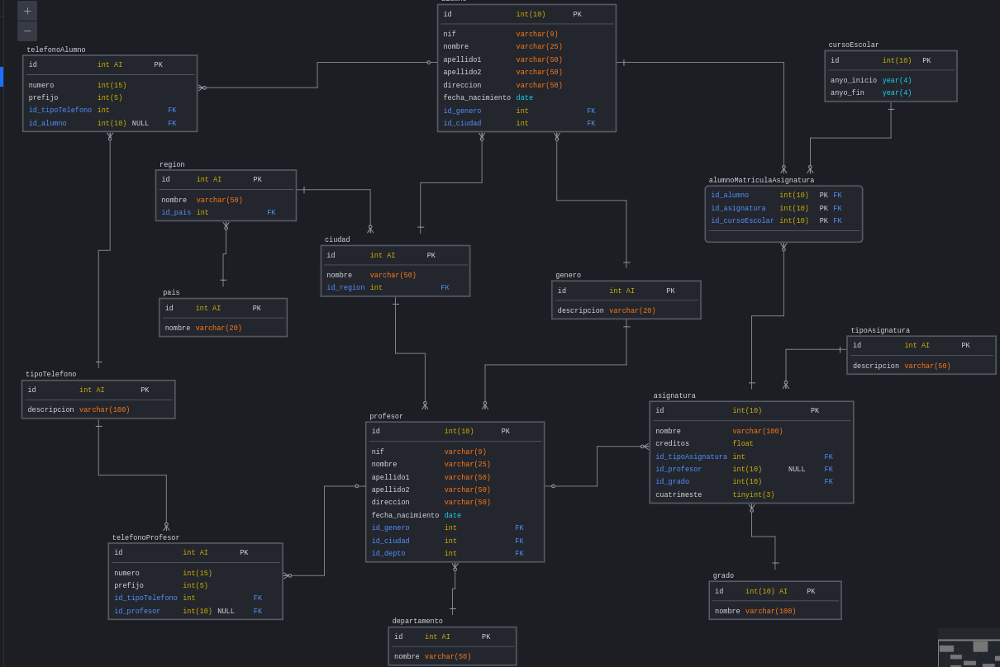

# TALLER PROCEDIMIENTOS Y VISTAS





**DDL(Data Definition Language):**

```mysql
create table pais(
    id int auto_increment primary key,
    nombre varchar(20) not null
);

create table region(
    id int auto_increment primary key,
    nombre varchar(50) not null,
    id_pais int not null,
    constraint FK_id_pais foreign key(id_pais) references pais(id)
);


create table ciudad(
    id int auto_increment primary key,
    nombre varchar(50) not null,
    id_region int  not null,
    constraint FK_id_region foreign key(id_region) references region(id)
);

create table departamento(
    id int auto_increment primary key,
    nombre varchar(50) not null
);

create table tipoTelefono(
    id int auto_increment primary key,
    descripcion varchar(100) not null
);

create table genero(
  id int auto_increment primary key,
  descripcion varchar(20) not null
);

create table tipoAsignatura(
  id int auto_increment primary key,
  descripcion varchar(50) not null
);

create table cursoEscolar(
  id int(10) primary key,
  anyo_inicio year(4) not null,
  anyo_fin year(4) not null
);

create table grado(
  id int(10) auto_increment primary key,
  nombre varchar(100) not null
);

create table alumno(
  id int(10) primary key,
  nif varchar(9) not null,
  nombre varchar(25) not null,
  apellido1 varchar(50) not null,
  apellido2 varchar(50) not null,
  direccion varchar(50) not null,
  fecha_nacimiento DATE not null,
  id_genero int not null,
  id_ciudad int not null,
  constraint FK_id_genero_estudiante foreign key(id_genero) references genero(id),
  constraint FK_id_ciudad_estudiante foreign key(id_ciudad) references ciudad(id)
);

create table profesor(
  id int(10) primary key,
  nif varchar(9) not null,
  nombre varchar(25) not null,
  apellido1 varchar(50) not null,
  apellido2 varchar(50) not null,
  direccion varchar(50) not null,
  fecha_nacimiento DATE not null,
  id_genero int not null,
  id_ciudad int not null,
  id_depto int not null,
  constraint FK_id_genero_profesor foreign key(id_genero) references genero(id),
  constraint FK_id_ciudad_profesor foreign key(id_ciudad) references ciudad(id),
  constraint FK_id_depto_profesor foreign key(id_depto) references departamento(id)
);

create table telefonoAlumno(
    id int auto_increment primary key,
    numero int(15) not null,
    prefijo int(5) not null,
    id_tipoTelefono int not null,
    id_alumno int(10),
    constraint FK_id_telefono_alumno foreign key(id_alumno) references alumno(id),
    constraint FK_id_tipoTelefono_alumno foreign key(id_tipoTelefono) references tipoTelefono(id)
);

create table telefonoProfesor(
    id int auto_increment primary key,
    numero int(15) not null,
    prefijo int(5) not null,
    id_tipoTelefono int not null,
    id_profesor int(10),
    constraint FK_id_telefono_profesor foreign key(id_profesor) references profesor(id),
    constraint FK_id_tipoTelefono_profesor foreign key(id_tipoTelefono) references tipoTelefono(id)
);

create table asignatura(
  id int(10) primary key,
  nombre varchar(100) not null,
  creditos float not null,
  id_tipoAsignatura int not null,
  id_profesor int(10),
  id_grado int(10) not null,
  cuatrimeste tinyint(3) not null,
  constraint FK_id_asignatura_tipoAsignatura foreign key(id_tipoAsignatura) references tipoAsignatura(id),
  constraint FK_id_asignatura_profesor foreign key(id_profesor) references profesor(id),
  constraint FK_id_asignatura_grado foreign key(id_grado) references grado(id)
);

create table alumnoMatriculaAsignatura(
  id_alumno int(10) not null,
  id_asignatura int(10) not null,
  id_cursoEscolar int(10) not null,
  constraint FK_id_alumno_matricula foreign key(id_alumno) references alumno(id),
  constraint FK_id_asignatura_matricula foreign key(id_asignatura) references asignatura(id),
  constraint FK_id_cursoEscolar_matricula foreign key(id_cursoEscolar) references cursoEscolar(id),
  primary key(id_alumno, id_asignatura, id_cursoEscolar)
);
```

**DML(Data Manipulation Language)**

**INSERTS**

```mysql
 /* Departamento */
INSERT INTO departamento VALUES (1, 'Informática');
INSERT INTO departamento VALUES (2, 'Matemáticas');
INSERT INTO departamento VALUES (3, 'Economía y Empresa');
INSERT INTO departamento VALUES (4, 'Educación');
INSERT INTO departamento VALUES (5, 'Agronomía');
INSERT INTO departamento VALUES (6, 'Química y Física');
INSERT INTO departamento VALUES (7, 'Filología');
INSERT INTO departamento VALUES (8, 'Derecho');
INSERT INTO departamento VALUES (9, 'Biología y Geología');

/* Países */
INSERT INTO pais (nombre) VALUES ('España');

/* Regiones */
INSERT INTO region (nombre, id_pais) VALUES ('Andalucía', 1);

/* Ciudades */
INSERT INTO ciudad (nombre, id_region) VALUES ('Almería', 1);

/* Tipo de teléfono */
INSERT INTO tipoTelefono (nombre) VALUES ('Fijo');

/* Generos*/
INSERT INTO genero(descripcion) values("hombre");
INSERT INTO genero(descripcion) values("mujer");
INSERT INTO genero(descripcion) values("no binario");

/* Tipo Asignatura*/
INSERT INTO tipoAsignatura VALUES (1, 'Básica');
INSERT INTO tipoAsignatura VALUES (2, 'Obligatoria');
INSERT INTO tipoAsignatura VALUES (3, 'Optativa');

/* Grado */
INSERT INTO grado VALUES (1, 'Grado en Ingeniería Agrícola (Plan 2015)');
INSERT INTO grado VALUES (2, 'Grado en Ingeniería Eléctrica (Plan 2014)');
INSERT INTO grado VALUES (3, 'Grado en Ingeniería Electrónica Industrial (Plan 2010)');
INSERT INTO grado VALUES (4, 'Grado en Ingeniería Informática (Plan 2015)');
INSERT INTO grado VALUES (5, 'Grado en Ingeniería Mecánica (Plan 2010)');
INSERT INTO grado VALUES (6, 'Grado en Ingeniería Química Industrial (Plan 2010)');
INSERT INTO grado VALUES (7, 'Grado en Biotecnología (Plan 2015)');
INSERT INTO grado VALUES (8, 'Grado en Ciencias Ambientales (Plan 2009)');
INSERT INTO grado VALUES (9, 'Grado en Matemáticas (Plan 2010)');
INSERT INTO grado VALUES (10, 'Grado en Química (Plan 2009)');

/* Curso escolar */
INSERT INTO cursoEscolar VALUES (1, 2014, 2015);
INSERT INTO cursoEscolar VALUES (2, 2015, 2016);
INSERT INTO cursoEscolar VALUES (3, 2016, 2017);
INSERT INTO cursoEscolar VALUES (4, 2017, 2018);

/* Alumno */
INSERT INTO alumno VALUES (1, '89542419S', 'Juan', 'Saez', 'Vega', 'C/ Mercurio', '1992/08/08', 2, 1);
INSERT INTO alumno VALUES (2, '26902806M', 'Salvador', 'Sánchez', 'Pérez', 'C/ Real del barrio alto', '1991/03/28', 2, 1);
INSERT INTO alumno VALUES (4, '17105885A', 'Pedro', 'Heller', 'Pagac', 'C/ Estrella fugaz', '2000/10/05', 2, 1);
INSERT INTO alumno VALUES (6, '04233869Y', 'José', 'Koss', 'Bayer', 'C/ Júpiter', '1998/01/28', 2, 1);
INSERT INTO alumno VALUES (7, '97258166K', 'Ismael', 'Strosin', 'Turcotte', 'C/ Neptuno', '1999/05/24', 2, 1);
INSERT INTO alumno VALUES (9, '82842571K', 'Ramón', 'Herzog', 'Tremblay', 'C/ Urano', '1996/11/21', 2, 1);
INSERT INTO alumno VALUES (11, '46900725E', 'Daniel', 'Herman', 'Pacocha', 'C/ Andarax', '1997/04/26', 2, 1);
INSERT INTO alumno VALUES (19, '11578526G', 'Inma', 'Lakin', 'Yundt', 'C/ Picos de Europa', '1998/09/01', 3, 1);
INSERT INTO alumno VALUES (21, '79089577Y', 'Juan', 'Gutiérrez', 'López', 'C/ Los pinos', '1998/01/01', 2, 1);
INSERT INTO alumno VALUES (22, '41491230N', 'Antonio', 'Domínguez', 'Guerrero', 'C/ Cabo de Gata', '1999/02/11', 2, 1);
INSERT INTO alumno VALUES (23, '64753215G', 'Irene', 'Hernández', 'Martínez', 'C/ Zapillo', '1996/03/12', 3, 1);
INSERT INTO alumno VALUES (24, '85135690V', 'Sonia', 'Gea', 'Ruiz', 'C/ Mercurio', '1995/04/13', 3, 1);

/* Telefono Alumno */
INSERT INTO telefonoAlumno (numero, prefijo, id_tipoTelefono, id_alumno) VALUES (618253876, 950, 1, 1);
INSERT INTO telefonoAlumno (numero, prefijo, id_tipoTelefono, id_alumno) VALUES (950254837, 950, 1, 2);
INSERT INTO telefonoAlumno (numero, prefijo, id_tipoTelefono, id_alumno) VALUES (628349590, 950, 1, 6);
INSERT INTO telefonoAlumno (numero, prefijo, id_tipoTelefono, id_alumno) VALUES (679837625, 950, 1, 11);
INSERT INTO telefonoAlumno (numero, prefijo, id_tipoTelefono, id_alumno) VALUES (678652431, 950, 1, 19);
INSERT INTO telefonoAlumno (numero, prefijo, id_tipoTelefono, id_alumno) VALUES (678652431, 950, 1, 21);
INSERT INTO telefonoAlumno (numero, prefijo, id_tipoTelefono, id_alumno) VALUES (626652498, 950, 1, 22);
INSERT INTO telefonoAlumno (numero, prefijo, id_tipoTelefono, id_alumno) VALUES (628452384, 950, 1, 23);
INSERT INTO telefonoAlumno (numero, prefijo, id_tipoTelefono, id_alumno) VALUES (678812017, 950, 1, 24);


/* Profesor */
INSERT INTO profesor VALUES (3, '11105554G', 'Zoe', 'Ramirez', 'Gea', 'C/ Marte', '1979-08-19', 3, 1, 1);
INSERT INTO profesor VALUES (5, '38223286T', 'David', 'Schmidt', 'Fisher', 'C/ Venus', '1978-01-19', 2, 1, 2);
INSERT INTO profesor VALUES (8, '79503962T', 'Cristina', 'Lemke', 'Rutherford', 'C/ Saturno', '1977-08-21', 3, 1, 3);
INSERT INTO profesor VALUES (10, '61142000L', 'Esther', 'Spencer', 'Lakin', 'C/ Plutón', '1977-05-19', 3, 1, 4);
INSERT INTO profesor VALUES (12, '85366986W', 'Carmen', 'Streich', 'Hirthe', 'C/ Almanzora', '1971-04-29', 3, 1, 4);
INSERT INTO profesor VALUES (13, '73571384L', 'Alfredo', 'Stiedemann', 'Morissette', 'C/ Guadalquivir', '1980-02-01', 2, 1, 6);
INSERT INTO profesor VALUES (14, '82937751G', 'Manolo', 'Hamill', 'Kozey', 'C/ Duero', '1977-01-02', 2, 1, 1);
INSERT INTO profesor VALUES (15, '80502866Z', 'Alejandro', 'Kohler', 'Schoen', 'C/ Tajo', '1980-03-14', 2, 1, 2);
INSERT INTO profesor VALUES (16, '10485008K', 'Antonio', 'Fahey', 'Considine', 'C/ Sierra de los Filabres', '1982-03-18', 2, 1, 3);
INSERT INTO profesor VALUES (17, '85869555K', 'Guillermo', 'Ruecker', 'Upton', 'C/ Sierra de Gádor', '1973-05-05', 2, 1, 4);
INSERT INTO profesor VALUES (18, '04326833G', 'Micaela', 'Monahan', 'Murray', 'C/ Veleta', '1976-02-25', 2, 1, 5);
INSERT INTO profesor VALUES (20, '79221403L', 'Francesca', 'Schowalter', 'Muller', 'C/ Quinto pino', '1980-10-31', 2, 1, 6);
INSERT INTO profesor VALUES (21, '13175769N', 'Pepe', 'Sánchez', 'Ruiz', 'C/ Quinto pino', '1980-10-16', 2, 1, 1);
INSERT INTO profesor VALUES (22, '98816696W', 'Juan', 'Guerrero', 'Martínez', 'C/ Quinto pino', '1980-11-21', 2, 1, 1);
INSERT INTO profesor VALUES (23, '77194445M', 'María', 'Domínguez', 'Hernández', 'C/ Quinto pino', '1980-12-13', 3, 1, 2);

/* Telefono Profesor*/

INSERT INTO telefonoProfesor (numero, prefijo, id_tipoTelefono, id_profesor) VALUES (618223876, 950, 1, 3);
INSERT INTO telefonoProfesor (numero, prefijo, id_tipoTelefono, id_profesor) VALUES (678516294, 950, 1, 5);
INSERT INTO telefonoProfesor (numero, prefijo, id_tipoTelefono, id_profesor) VALUES (669162534, 950, 1, 8);
INSERT INTO telefonoProfesor (numero, prefijo, id_tipoTelefono, id_profesor) VALUES (950263514, 950, 1, 14);
INSERT INTO telefonoProfesor (numero, prefijo, id_tipoTelefono, id_profesor) VALUES (668726354, 950, 1, 15);
INSERT INTO telefonoProfesor (numero, prefijo, id_tipoTelefono, id_profesor) VALUES (662765413, 950, 1, 18);


/* Asignatura */
INSERT INTO asignatura VALUES (1, 'Álgegra lineal y matemática discreta', 6, 1, NULL, 4, 1);
INSERT INTO asignatura VALUES (2, 'Cálculo', 6, 1, NULL, 4, 1);
INSERT INTO asignatura VALUES (3, 'Física para informática', 6, 1, NULL, 4, 1);
INSERT INTO asignatura VALUES (4, 'Introducción a la programación', 6, 1, NULL, 4, 1);
INSERT INTO asignatura VALUES (5, 'Organización y gestión de empresas', 6, 1, NULL, 4, 1);
INSERT INTO asignatura VALUES (6, 'Estadística', 6, 1, NULL, 4, 2);
INSERT INTO asignatura VALUES (7, 'Estructura y tecnología de computadores', 6, 1, NULL, 4, 2);
INSERT INTO asignatura VALUES (8, 'Fundamentos de electrónica', 6, 1, NULL, 4, 2);
INSERT INTO asignatura VALUES (9, 'Lógica y algorítmica', 6, 1, NULL, 4, 2);
INSERT INTO asignatura VALUES (10, 'Metodología de la programación', 6, 1, NULL, 4, 2);
INSERT INTO asignatura VALUES (11, 'Arquitectura de Computadores', 6, 1, 3, 4, 1);
INSERT INTO asignatura VALUES (12, 'Estructura de Datos y Algoritmos I', 6, 2, 3, 4, 1);
INSERT INTO asignatura VALUES (13, 'Ingeniería del Software', 6, 2, 3, 4, 1);
INSERT INTO asignatura VALUES (14, 'Sistemas Inteligentes', 6, 2, 3, 4, 1);
INSERT INTO asignatura VALUES (15, 'Sistemas Operativos', 6, 2, 3, 4, 1);
INSERT INTO asignatura VALUES (16, 'Bases de Datos', 6, 1, 14, 4, 2);
INSERT INTO asignatura VALUES (17, 'Estructura de Datos y Algoritmos II', 6, 2, 14, 4, 2);
INSERT INTO asignatura VALUES (18, 'Fundamentos de Redes de Computadores', 6, 2, 3, 4, 2);
INSERT INTO asignatura VALUES (19, 'Planificación y Gestión de Proyectos Informáticos', 6, 2, 3, 4, 2);
INSERT INTO asignatura VALUES (20, 'Programación de Servicios Software', 6, 2, 14, 4, 2);
INSERT INTO asignatura VALUES (21, 'Desarrollo de interfaces de usuario', 6, 2, 14, 4, 3);
INSERT INTO asignatura VALUES (22, 'Ingeniería de Requisitos', 6, 3, NULL, 4, 3);
INSERT INTO asignatura VALUES (23, 'Integración de las Tecnologías de la Información en las Organizaciones', 6, 3, NULL, 4, 3);
INSERT INTO asignatura VALUES (24, 'Modelado y Diseño del Software 1', 6, 3, NULL, 4, 3);
INSERT INTO asignatura VALUES (25, 'Multiprocesadores', 6, 3, NULL, 4, 3);
INSERT INTO asignatura VALUES (26, 'Seguridad y cumplimiento normativo', 6, 3, NULL, 4, 3);
INSERT INTO asignatura VALUES (27, 'Sistema de Información para las Organizaciones', 6, 3, NULL, 4, 3); 
INSERT INTO asignatura VALUES (28, 'Tecnologías web', 6, 3, NULL, 4, 3);
INSERT INTO asignatura VALUES (29, 'Teoría de códigos y criptografía', 6, 3, NULL, 4, 3);
INSERT INTO asignatura VALUES (30, 'Administración de bases de datos', 6, 3, NULL, 4, 4);
INSERT INTO asignatura VALUES (31, 'Herramientas y Métodos de Ingeniería del Software', 6, 3, NULL, 4, 4);
INSERT INTO asignatura VALUES (32, 'Informática industrial y robótica', 6, 3, NULL, 4, 4);
INSERT INTO asignatura VALUES (33, 'Ingeniería de Sistemas de Información', 6, 3, NULL, 4, 4);
INSERT INTO asignatura VALUES (34, 'Modelado y Diseño del Software 2', 6, 3, NULL, 4, 4);
INSERT INTO asignatura VALUES (35, 'Negocio Electrónico', 6, 3, NULL, 4, 4);
INSERT INTO asignatura VALUES (36, 'Periféricos e interfaces', 6, 3, NULL, 4, 4);
INSERT INTO asignatura VALUES (37, 'Sistemas de tiempo real', 6, 3, NULL, 4, 4);
INSERT INTO asignatura VALUES (38, 'Tecnologías de acceso a red', 6, 3, NULL, 4, 4);
INSERT INTO asignatura VALUES (39, 'Tratamiento digital de imágenes', 6, 3, NULL, 4, 4);
INSERT INTO asignatura VALUES (40, 'Administración de redes y sistemas operativos', 6, 3, NULL, 4, 5);
INSERT INTO asignatura VALUES (41, 'Almacenes de Datos', 6, 3, NULL, 4, 5);
INSERT INTO asignatura VALUES (42, 'Fiabilidad y Gestión de Riesgos', 6, 3, NULL, 4, 5);
INSERT INTO asignatura VALUES (43, 'Líneas de Productos Software', 6, 3, NULL, 4, 5);
INSERT INTO asignatura VALUES (44, 'Procesos de Ingeniería del Software 1', 6, 3, NULL, 4, 5);
INSERT INTO asignatura VALUES (45, 'Tecnologías multimedia', 6, 3, NULL, 4, 5);
INSERT INTO asignatura VALUES (46, 'Análisis y planificación de las TI', 6, 3, NULL, 4, 6);
INSERT INTO asignatura VALUES (47, 'Desarrollo Rápido de Aplicaciones', 6, 3, NULL, 4, 6);
INSERT INTO asignatura VALUES (48, 'Gestión de la Calidad y de la Innovación Tecnológica', 6, 3, NULL, 4, 6);
INSERT INTO asignatura VALUES (49, 'Inteligencia del Negocio', 6, 3, NULL, 4, 6);
INSERT INTO asignatura VALUES (50, 'Procesos de Ingeniería del Software 2', 6, 3, NULL, 4, 6);
INSERT INTO asignatura VALUES (51, 'Seguridad Informática', 6, 3, NULL, 4, 6);
INSERT INTO asignatura VALUES (52, 'Biologia celular', 6, 1, NULL, 7, 1);
INSERT INTO asignatura VALUES (53, 'Física', 6, 1, NULL, 7, 1);
INSERT INTO asignatura VALUES (54, 'Matemáticas I', 6, 1, NULL, 7, 1);
INSERT INTO asignatura VALUES (55, 'Química general', 6, 1, NULL, 7, 1);
INSERT INTO asignatura VALUES (56, 'Química orgánica', 6, 1, NULL, 7, 1);
INSERT INTO asignatura VALUES (57, 'Biología vegetal y animal', 6, 1, NULL, 7, 2);
INSERT INTO asignatura VALUES (58, 'Bioquímica', 6, 1, NULL, 7, 2);
INSERT INTO asignatura VALUES (59, 'Genética', 6, 1, NULL, 7, 2);
INSERT INTO asignatura VALUES (60, 'Matemáticas II', 6, 1, NULL, 7, 2);
INSERT INTO asignatura VALUES (61, 'Microbiología', 6, 1, NULL, 7, 2);
INSERT INTO asignatura VALUES (62, 'Botánica agrícola', 6, 2, NULL, 7, 1);
INSERT INTO asignatura VALUES (63, 'Fisiología vegetal', 6, 2, NULL, 7, 1);
INSERT INTO asignatura VALUES (64, 'Genética molecular', 6, 2, NULL, 7, 1);
INSERT INTO asignatura VALUES (65, 'Ingeniería bioquímica', 6, 2, NULL, 7, 1);
INSERT INTO asignatura VALUES (66, 'Termodinámica y cinética química aplicada', 6, 2, NULL, 7, 1);
INSERT INTO asignatura VALUES (67, 'Biorreactores', 6, 2, NULL, 7, 2);
INSERT INTO asignatura VALUES (68, 'Biotecnología microbiana', 6, 2, NULL, 7, 2);
INSERT INTO asignatura VALUES (69, 'Ingeniería genética', 6, 2, NULL, 7, 2);
INSERT INTO asignatura VALUES (70, 'Inmunología', 6, 2, NULL, 7, 2);
INSERT INTO asignatura VALUES (71, 'Virología', 6, 2, NULL, 7, 2);
INSERT INTO asignatura VALUES (72, 'Bases moleculares del desarrollo vegetal', 4.5, 2, NULL, 7, 3);
INSERT INTO asignatura VALUES (73, 'Fisiología animal', 4.5, 2, NULL, 7, 3);
INSERT INTO asignatura VALUES (74, 'Metabolismo y biosíntesis de biomoléculas', 6, 2, NULL, 7, 3);
INSERT INTO asignatura VALUES (75, 'Operaciones de separación', 6, 2, NULL, 7, 3);
INSERT INTO asignatura VALUES (76, 'Patología molecular de plantas', 4.5, 2, NULL, 7, 3);
INSERT INTO asignatura VALUES (77, 'Técnicas instrumentales básicas', 4.5, 2, NULL, 7, 3);
INSERT INTO asignatura VALUES (78, 'Bioinformática', 4.5, 2, NULL, 7, 4);
INSERT INTO asignatura VALUES (79, 'Biotecnología de los productos hortofrutículas', 4.5, 2, NULL, 7, 4);
INSERT INTO asignatura VALUES (80, 'Biotecnología vegetal', 6, 2, NULL, 7, 4);
INSERT INTO asignatura VALUES (81, 'Genómica y proteómica', 4.5, 2, NULL, 7, 4);
INSERT INTO asignatura VALUES (82, 'Procesos biotecnológicos', 6, 2, NULL, 7, 4);
INSERT INTO asignatura VALUES (83, 'Técnicas instrumentales avanzadas', 4.5, 2, NULL, 7, 4);

/* Matriculas*/
INSERT INTO alumnoMatriculaAsignatura VALUES (1, 1, 1);
INSERT INTO alumnoMatriculaAsignatura VALUES (1, 2, 1);
INSERT INTO alumnoMatriculaAsignatura VALUES (1, 3, 1);
INSERT INTO alumnoMatriculaAsignatura VALUES (1, 4, 1);
INSERT INTO alumnoMatriculaAsignatura VALUES (1, 5, 1);
INSERT INTO alumnoMatriculaAsignatura VALUES (1, 6, 1);
INSERT INTO alumnoMatriculaAsignatura VALUES (1, 7, 1);
INSERT INTO alumnoMatriculaAsignatura VALUES (1, 8, 1);
INSERT INTO alumnoMatriculaAsignatura VALUES (1, 9, 1);
INSERT INTO alumnoMatriculaAsignatura VALUES (1, 10, 1);
INSERT INTO alumnoMatriculaAsignatura VALUES (1, 1, 2);
INSERT INTO alumnoMatriculaAsignatura VALUES (1, 2, 2);
INSERT INTO alumnoMatriculaAsignatura VALUES (1, 3, 2);
INSERT INTO alumnoMatriculaAsignatura VALUES (1, 1, 3);
INSERT INTO alumnoMatriculaAsignatura VALUES (1, 2, 3);
INSERT INTO alumnoMatriculaAsignatura VALUES (1, 3, 3);
INSERT INTO alumnoMatriculaAsignatura VALUES (1, 1, 4);
INSERT INTO alumnoMatriculaAsignatura VALUES (1, 2, 4);
INSERT INTO alumnoMatriculaAsignatura VALUES (1, 3, 4);
INSERT INTO alumnoMatriculaAsignatura VALUES (2, 1, 1);
INSERT INTO alumnoMatriculaAsignatura VALUES (2, 2, 1);
INSERT INTO alumnoMatriculaAsignatura VALUES (2, 3, 1);
INSERT INTO alumnoMatriculaAsignatura VALUES (4, 1, 1);
INSERT INTO alumnoMatriculaAsignatura VALUES (4, 2, 1);
INSERT INTO alumnoMatriculaAsignatura VALUES (4, 3, 1);
INSERT INTO alumnoMatriculaAsignatura VALUES (4, 1, 2);
INSERT INTO alumnoMatriculaAsignatura VALUES (4, 2, 2);
INSERT INTO alumnoMatriculaAsignatura VALUES (4, 3, 2);
INSERT INTO alumnoMatriculaAsignatura VALUES (4, 4, 2);
INSERT INTO alumnoMatriculaAsignatura VALUES (4, 5, 2);
INSERT INTO alumnoMatriculaAsignatura VALUES (4, 6, 2);
INSERT INTO alumnoMatriculaAsignatura VALUES (4, 7, 2);
INSERT INTO alumnoMatriculaAsignatura VALUES (4, 8, 2);
INSERT INTO alumnoMatriculaAsignatura VALUES (4, 9, 2);
INSERT INTO alumnoMatriculaAsignatura VALUES (4, 10, 2);
```

**CREACION DE LA VISTAS**

```mysql
/*1*/
CREATE VIEW alumnosCiudad AS
SELECT a.id AS alumnoId, a.nombre AS nombreAlumno, c.nombre AS ciudad
FROM alumno a
JOIN ciudad c ON a.id_ciudad = c.id;

/*2*/
CREATE VIEW profesoresDepartamento AS
SELECT p.id AS profesorId, p.nombre AS nombreProfesor, d.nombre AS departamento
FROM profesor p
JOIN departamento d ON p.id_depto = d.id;

/*3*/
CREATE VIEW asignaturasGrado AS
SELECT a.id AS asignaturaId, a.nombre AS nombreAsignatura, g.nombre AS grado
FROM asignatura a
JOIN grado g ON a.id_grado = g.id;

/*4*/
CREATE VIEW telefonosAlumnos AS
SELECT ta.id AS telefonoId, ta.numero AS numeroTelefono, ta.prefijo AS prefijoTelefono, t.descripcion AS tipoTelefono, a.nombre AS nombreAlumno
FROM telefonoAlumno ta
JOIN tipoTelefono t ON ta.id_tipoTelefono = t.id
JOIN alumno a ON ta.id_alumno = a.id;

/*5*/
CREATE VIEW telefonosProfesores AS
SELECT tp.id AS telefonoId, tp.numero AS numeroTelefono, tp.prefijo AS prefijoTelefono, t.descripcion AS tipoTelefono, p.nombre AS nombreProfesor
FROM telefonoProfesor tp
JOIN tipoTelefono t ON tp.id_tipoTelefono = t.id
JOIN profesor p ON tp.id_profesor = p.id;

/*6*/
CREATE VIEW asignaturasProfesor AS
SELECT a.id AS asignaturaId, a.nombre AS nombreAsignatura, p.nombre AS nombreProfesor
FROM asignatura a
JOIN profesor p ON a.id_profesor = p.id;

/*7*/
CREATE VIEW alumnosMatriculados AS
SELECT am.id_alumno AS alumnoId, a.nombre AS nombreAlumno, am.id_asignatura AS asignaturaId, asig.nombre AS nombreAsignatura, am.id_cursoEscolar AS cursoEscolarId
FROM alumnoMatriculaAsignatura am
JOIN alumno a ON am.id_alumno = a.id
JOIN asignatura asig ON am.id_asignatura = asig.id;

/*8*/
CREATE VIEW profesoresPorCiudad AS
SELECT p.id AS profesorId, p.nombre AS nombreProfesor, c.nombre AS ciudad
FROM profesor p
JOIN ciudad c ON p.id_ciudad = c.id;

/*9*/
CREATE VIEW asignaturasPorTipo AS
SELECT a.id AS asignaturaId, a.nombre AS nombreAsignatura, t.descripcion AS tipoAsignatura
FROM asignatura a
JOIN tipoAsignatura t ON a.id_tipoAsignatura = t.id;

/*10*/
CREATE VIEW alumnosPorGenero AS
SELECT a.id AS alumnoId, a.nombre AS nombreAlumno, g.descripcion AS genero
FROM alumno a
JOIN genero g ON a.id_genero = g.id;

```

**PROCEDIMIENTOS**

```mysql
/* 1.INSERTAR ALUMNO */
DELIMITER //
CREATE PROCEDURE insertNewAlumno(
    IN nif VARCHAR(9),
    IN nombre VARCHAR(25),
    IN apellido1 VARCHAR(50),
    IN apellido2 VARCHAR(50),
    IN direccion VARCHAR(50),
    IN fecha_nacimiento DATE,
    IN id_genero INT,
    IN id_ciudad INT
)
BEGIN
    INSERT INTO alumno(nif, nombre, apellido1, apellido2, direccion, fecha_nacimiento, id_genero, id_ciudad)
    VALUES (nif, nombre, apellido1, apellido2, direccion, fecha_nacimiento, id_genero, id_ciudad);
END //
DELIMITER ;

/* 2.ACTUALIZAR DIRECCION DE PROFESOR */
DELIMITER //
CREATE PROCEDURE updateProfesorDireccion(
    IN prof_id INT,
    IN new_address VARCHAR(50)
)
BEGIN
    UPDATE profesor
    SET direccion = new_address
    WHERE id = prof_id;
END //
DELIMITER ;

/* 3.BORRAR TELEFONO DE PROFESOR */
DELIMITER //
CREATE PROCEDURE deleteTelefonoProfesor(
    IN telefono_id INT
)
BEGIN
    DELETE FROM telefonoProfesor
    WHERE id = telefono_id;
END //
DELIMITER ;

/* 4.INSERTAR NUEVA ASIGNATURA */
DELIMITER //
CREATE PROCEDURE insertNewAsignatura(
    IN nombre VARCHAR(100),
    IN creditos FLOAT,
    IN id_tipoAsignatura INT,
    IN id_profesor INT,
    IN id_grado INT,
    IN cuatrimeste TINYINT
)
BEGIN
    INSERT INTO asignatura(nombre, creditos, id_tipoAsignatura, id_profesor, id_grado, cuatrimeste)
    VALUES (nombre, creditos, id_tipoAsignatura, id_profesor, id_grado, cuatrimeste);
END //
DELIMITER ;

/* 5.BORRAR MATRICULA DE UN ALUMNO*/
DELIMITER //
CREATE PROCEDURE deleteAlumnoMatriculado(
    IN alumno_id INT,
    IN asignatura_id INT,
    IN curso_escolar_id INT
)
BEGIN
    DELETE FROM alumnoMatriculaAsignatura
    WHERE id_alumno = alumno_id AND id_asignatura = asignatura_id AND id_cursoEscolar = curso_escolar_id;
END //
DELIMITER ;

/* 6.ACTUALIZAR TELEFONO DE ALUMNO */
DELIMITER //
CREATE PROCEDURE updateTelefonoAlumno(
    IN telefono_id INT,
    IN new_numero INT,
    IN new_prefijo INT
)
BEGIN
    UPDATE telefonoAlumno
    SET numero = new_numero, prefijo = new_prefijo
    WHERE id = telefono_id;
END //
DELIMITER ;

/* 7.ASIGNAR PROFESOR A ASIGNATURA*/
CREATE PROCEDURE insertAsignaturaProfesor(
    IN p_id_asignatura INT,
    IN p_id_profesor INT
)
BEGIN
    UPDATE asignatura
    SET id_profesor = p_id_profesor
    WHERE id = p_id_asignatura;
END;

/* 8.BORRAR TELEFONO ALUMNO */
CREATE PROCEDURE deleteTelefonoAlumno(
    IN p_telefono_id INT
)
BEGIN
    DELETE FROM telefonoAlumno
    WHERE id = p_telefono_id;
END;

/* 9.ACTUALIZAR NOMBRE ALUMNO */
CREATE PROCEDURE updateNombreAlumno(
    IN p_alumno_id INT,
    IN p_nuevo_nombre VARCHAR(25)
)
BEGIN
    UPDATE alumno
    SET nombre = p_nuevo_nombre
    WHERE id = p_alumno_id;
END;

/* 10.BORRAR PROFESOR POR ID*/
CREATE PROCEDURE deleteTelefonoProfesorByID(
    IN p_telefono_id INT
)
BEGIN
    DELETE FROM telefonoProfesor
    WHERE id = p_telefono_id;
END;

```


**CONSULTAS**

**Consultas sobre una tabla**

1. Devuelve un listado con el primer apellido, segundo apellido y el nombre de
  todos los alumnos. El listado deberá estar ordenado alfabéticamente de
  menor a mayor por el primer apellido, segundo apellido y nombre.

  

  ```mysql
  
  ```

  

2. Averigua el nombre y los dos apellidos de los alumnos que no han dado de
  alta su número de teléfono en la base de datos.

  

  ```mysql
  
  ```

  

3. Devuelve el listado de los alumnos que nacieron en 1999.

   

   ```mysql
   
   ```

   

4. Devuelve el listado de profesores que no han dado de alta su número de
  teléfono en la base de datos y además su nif termina en K.

  

  ```mysql
  
  ```

  

5. Devuelve el listado de las asignaturas que se imparten en el primer
  cuatrimestre, en el tercer curso del grado que tiene el identificador 7.

  

  ```mysql
  
  ```

  

**Consultas multitabla (Composición interna)**

1. Devuelve un listado con los datos de todas las alumnas que se han
  matriculado alguna vez en el Grado en Ingeniería Informática (Plan 2015).

  

  ```mysql
  
  ```

  

2. Devuelve un listado con todas las asignaturas ofertadas en el Grado en
  Ingeniería Informática (Plan 2015).

  

  ```mysql
  
  ```

  

3. Devuelve un listado de los profesores junto con el nombre del
  departamento al que están vinculados. El listado debe devolver cuatro
  columnas, primer apellido, segundo apellido, nombre y nombre del
  departamento. El resultado estará ordenado alfabéticamente de menor a
  mayor por los apellidos y el nombre.

  

  ```mysql
  
  ```

  

4. Devuelve un listado con el nombre de las asignaturas, año de inicio y año de
  fin del curso escolar del alumno con nif 26902806M.

  

  ```mysql
  
  ```

  

5. Devuelve un listado con el nombre de todos los departamentos que tienen
  profesores que imparten alguna asignatura en el Grado en Ingeniería
  Informática (Plan 2015).

  

  ```mysql
  
  ```

  

6. Devuelve un listado con todos los alumnos que se han matriculado en
  alguna asignatura durante el curso escolar 2018/2019.

  

  ```mysql
  
  ```

  

**Consultas multitabla (Composición externa)**
**Resuelva todas las consultas utilizando las cláusulas LEFT JOIN y RIGHT JOIN.**

1. Devuelve un listado con los nombres de todos los profesores y los
  departamentos que tienen vinculados. El listado también debe mostrar
  aquellos profesores que no tienen ningún departamento asociado. El listado
  debe devolver cuatro columnas, nombre del departamento, primer apellido,
  segundo apellido y nombre del profesor. El resultado estará ordenado
  alfabéticamente de menor a mayor por el nombre del departamento,
  apellidos y el nombre.

  

  ```mysql
  
  ```

  

2. Devuelve un listado con los profesores que no están asociados a un
  departamento.

  

  ```mysql
  
  ```

  

3. Devuelve un listado con los departamentos que no tienen profesores
  asociados.

  

  ```mysql
  
  ```

  

4. Devuelve un listado con los profesores que no imparten ninguna asignatura.

   

   ```mysql
   
   ```

   

5. Devuelve un listado con las asignaturas que no tienen un profesor asignado.

   

   ```mysql
   
   ```

   

6. Devuelve un listado con todos los departamentos que tienen alguna
  asignatura que no se haya impartido en ningún curso escolar. El resultado
  debe mostrar el nombre del departamento y el nombre de la asignatura que
  no se haya impartido nunca.

  

  ```mysql
  
  ```

  

**Consultas resumen**

1. Devuelve el número total de alumnas que hay.

   

   ```mysql
   
   ```

   

2. Calcula cuántos alumnos nacieron en 1999.

   

   ```mysql
   
   ```

   

3. Calcula cuántos profesores hay en cada departamento. El resultado sólo
  debe mostrar dos columnas, una con el nombre del departamento y otra
  con el número de profesores que hay en ese departamento. El resultado
  sólo debe incluir los departamentos que tienen profesores asociados y
  deberá estar ordenado de mayor a menor por el número de profesores.

  

  ```mysql
  
  ```

  

4. Devuelve un listado con todos los departamentos y el número de profesores
  que hay en cada uno de ellos. Tenga en cuenta que pueden existir
  departamentos que no tienen profesores asociados. Estos departamentos
  también tienen que aparecer en el listado.

  

  ```mysql
  
  ```

  

5. Devuelve un listado con el nombre de todos los grados existentes en la base
  de datos y el número de asignaturas que tiene cada uno. Tenga en cuenta 
  que pueden existir grados que no tienen asignaturas asociadas. Estos grados
  también tienen que aparecer en el listado. El resultado deberá estar
  ordenado de mayor a menor por el número de asignaturas.

  

  ```mysql
  
  ```

  

6. Devuelve un listado con el nombre de todos los grados existentes en la base
  de datos y el número de asignaturas que tiene cada uno, de los grados que
  tengan más de 40 asignaturas asociadas.

  

  ```mysql
  
  ```

  

7. Devuelve un listado que muestre el nombre de los grados y la suma del
  número total de créditos que hay para cada tipo de asignatura. El resultado
  debe tener tres columnas: nombre del grado, tipo de asignatura y la suma
  de los créditos de todas las asignaturas que hay de ese tipo. Ordene el
  resultado de mayor a menor por el número total de crédidos.

  

  ```mysql
  
  ```

  

8. Devuelve un listado que muestre cuántos alumnos se han matriculado de
  alguna asignatura en cada uno de los cursos escolares. El resultado deberá
  mostrar dos columnas, una columna con el año de inicio del curso escolar y
  otra con el número de alumnos matriculados.

  

  ```mysql
  
  ```

  

9. Devuelve un listado con el número de asignaturas que imparte cada
  profesor. El listado debe tener en cuenta aquellos profesores que no
  imparten ninguna asignatura. El resultado mostrará cinco columnas: id,
  nombre, primer apellido, segundo apellido y número de asignaturas. El
  resultado estará ordenado de mayor a menor por el número de asignaturas.

  

  ```mysql
  
  ```

  

**Subconsultas**

1. Devuelve todos los datos del alumno más joven.

   

   ```mysql
   
   ```

   

2. Devuelve un listado con los profesores que no están asociados a un
  departamento.

  

  ```mysql
  
  ```

  

3. Devuelve un listado con los departamentos que no tienen profesores
  asociados.

  

  ```mysql
  
  ```

  

4. Devuelve un listado con los profesores que tienen un departamento
  asociado y que no imparten ninguna asignatura.

  

  ```mysql
  
  ```

  

5. Devuelve un listado con las asignaturas que no tienen un profesor asignado.

   

   ```mysql
   
   ```

   

6. Devuelve un listado con todos los departamentos que no han impartido
  asignaturas en ningún curso escolar.

  ```mysql
  
  ```

  